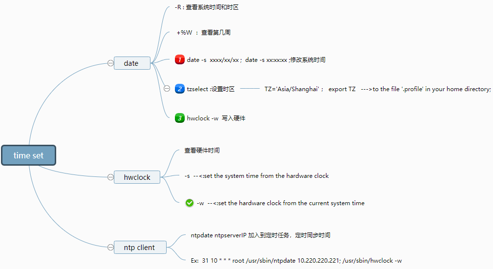

# linux tools and time

::: tip 
- X Window 更改配置，注销重新登录即可，or   alt + ctrl + backspace
- X Window 与命令行模式切换， ctrl + alt + f1 ~  f6
- Exit 注销登录，离开linux系统，结束登录任务
- Command
    - date:  date  +%W  第几周
    - date  +%Y/%m/%d\  \  %H:%M 格式化输出时间
    - --date="1 days ago" (-d  "20221001") 指定日期
    - cal 日历
    - bc计算器
    - ctrl + D 代表键盘输入结束 EOF  end of file, 命令行模式直接注销相当于exit
    - man/info   查看帮助信息
- 关机
    - 查看当前使用状态 who ,  ps -aux
    - sync 数据同步写入磁盘
    - reboot shutdown poweroff

:::

### Time set

