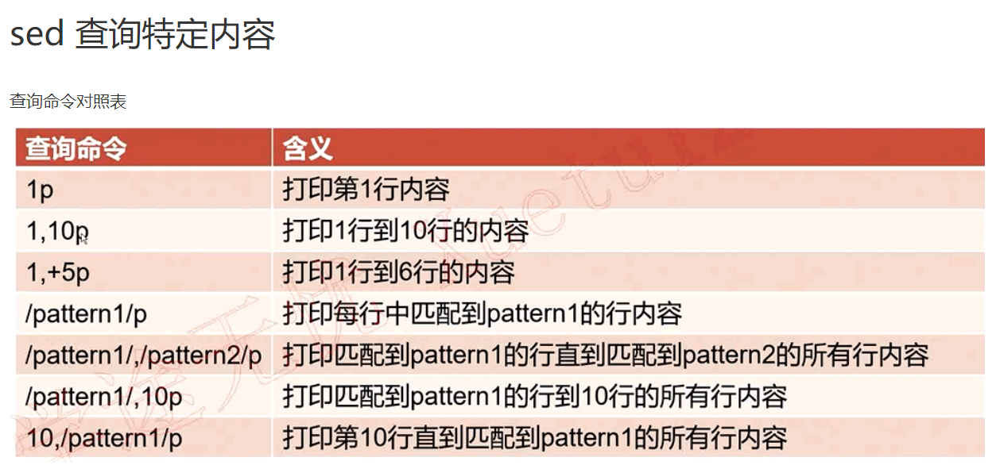

# regular_expression

::: tip RE
- 通过一些特殊符号的辅住，让用户轻易地完成【查找，删除，替换】某特定字符串的处理过程
- Vi 、grep、awk、sed等程序都支持正则表达式； ls cp等命令不支持正则表达式，只能使用bash本身的通配符
- 语系LANG对正则表达式影响（字符排序）
- 字符集合【^ $ . \ * [list] [n1-n2] [^list] \{m,n\} 】
    -  . 任意字符
	- *重复前一个字符0-无穷
	- shell中{}需要转义
:::

::: tip grep
- grep👻:  searches  for  PATTERNS  in  each  FILE
    - ==-i==: Ignore case distinctions in patterns and input data
    - ==-n==: 显示行号
    - ==-v==: 反选 EX: grep -v "^#" | grep -v "^$"(不显示注释行和空白行)
    - ==-x==: 行内容完全匹配
:::

::: tip sed
-  Sed  [-nefri]  [n1[,n2]] function
	- 参数部分
		- -n 使用安静模式，只有被sed处理操作的行才被列出来
		- -e 直接在命令行模式上进行sed的操作编辑
    -  操作 [n1[,n2]] function 
		-  a :新增，后面可以接字符串，下一行插入字符 sed  '2a  xxx'
		-  c :替换，后面可以接字符串，替换n1 n2之间的行  sed  '2,5c  xxx'
		-  d :删除，后面不接内容，删除n1 n2之间行， sed '2,5d'
		-  i :插入，后面可以接字符串，上一行插入  sed  '2,5i  xxx'
		-  p :打印（选择），选择数据打印，==与-n搭配==  sed  -n '2,5p'
		-  s :替换，通常搭配正则表达式， 1,20s/old/new/g； n1  ,n2选定指定行操作，也可以/pattern1/,  /pattern2/选择指定行，支持正则
- 

:::

::: tip awk 分行处理多个字段(循环处理每一行)
-  awk  -F  x  '条件 {操作} 条件{操作} 。。。'  filename
- 条件：BEGIN  END   $1 >< >== num
- 内置变量 NF 每行$0拥有的字段数；NR当前处理的行号；FS目前的分隔符
- EX👻: cat /etc/passwd |awk -F  :  '{print "linsnum:" NR "\t  current:" $3} $3 < 10 {sum += $3} END {print sum}'

:::

::: tip 文件对比工具
-  diff  -ibB (blan space  ignore)  from_file to_file
-   cpm  以字节比对，可以比较二进制文件 
-  patch 将旧文件升级为新文件
    i. 生成patch文件， diff  -Naur  file.old  file.new > xxxx.patch
    ii. 更新旧版数据，  patch  -p0  -d work_dir   < patch_file
    iii. 撤销更新， patch  -R  -p0   < patch_file
    
:::
