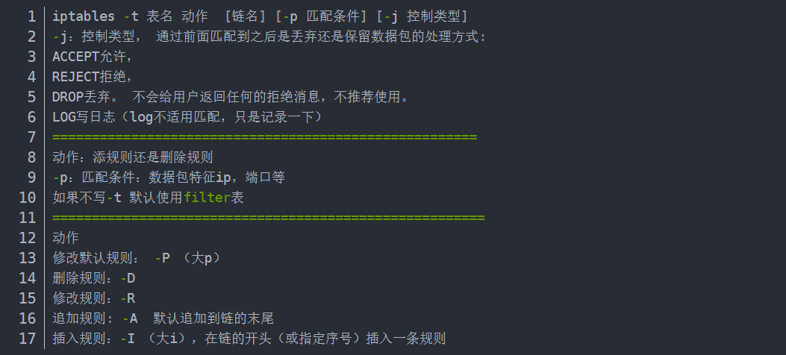
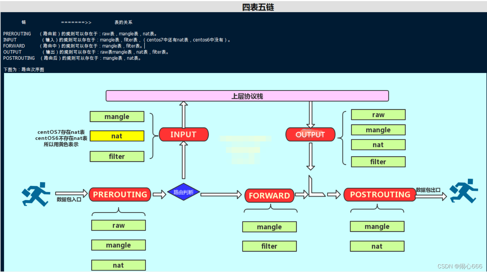

# system-operation-Note

#### netstat 查看端口

::: tip 
netstat -tunlp | grep 端口号
-     -t (tcp) 仅显示tcp相关选项
- -u (udp)仅显示udp相关选项
- ==-n 拒绝显示别名，能显示数字的全部转化为数字==
- -l 仅列出在Listen(监听)的服务状态
- -p 显示建立相关链接的程序名
:::

#### ln软连接
::: tip 
- create symbolic: ==ln -s [目标目录] [链接link_name]== 
- modify symbolic: ==ln -snf [目标目录] [新链接link_name]==
    - -n 将 LINK_NAME 视为普通文件，如果它是指向目录的符号链接
    - -f force强制
- 删除：rm -rf [链接link_name]  软链接地址最后==不能含有“/”==，当含有“/”时，删除的是软链接目标目录下的资源，而不是软链接本身。
                                 
:::

#### iptables + firewalld
[Link](https://blog.csdn.net/weixin_61200840/article/details/121713157)

::: tip firewalld 常用command
---
- firewalld-cmd --zone=public --list-ports 查看所有开发端口
- ==firewalld-cmd --zone=public --add-port=9200/tcp --permanet==  端口开放添加
- firewalld-cmd --reload 重新加载
- firewalld-cmd --zone=public --remove-port=9200/tcp --permanet  开发端口删除

Content
:::

::: tip iptables
主机防火墙：主要是用来防范单台主机的进出报文；-----filter表·
网络防火墙: 能够实现对进出本网络的所有主机报文加以防护----nat表

- 缺点
（1）防火墙虽然可以过滤互联网的数据包，但却无法过滤内部网络的数据包。因此若有人从内部网络攻击时，防火墙没有作用。
（2）电脑本身的操作系统亦可能因一些系统漏洞，使入侵者可以利用这些漏洞绕过防火墙过滤，从而入侵电脑。
:::

::: tip firewalld
- firewalld 与 iptables 都是 linux 中防火墙的==管理程序==，但其实其角色主要为对于防火墙策略的管理，真正的防火墙执行者是位于内核中的netfilter
- iptables 每一个单独更改意味着清除所有旧的规则，并从 /etc/sysconfig/iptables 中==读取所有新的规则==；而 firewalld 在有规则变动后，可以==仅仅运行规则中的不同之处，即在 firewalld 运行时间内，改变设置时可以不丢失现行链接==
- iptables 没有守护进程，并不能算是真正意义上的服务；而 firewalld 有守护进程
- firewalld和iptables一样，==它们的作用都用于维护规则==，而真正使用规则干活的是内核的netfilter。只不过firewalld和iptables的结果以及使用方法不一样
- firewalld默认是拒绝的，需要设置以后才能放行。而iptables默认是允许的，需要拒绝的才去限制；
:::
iptables 常用命令 和 四表五链

