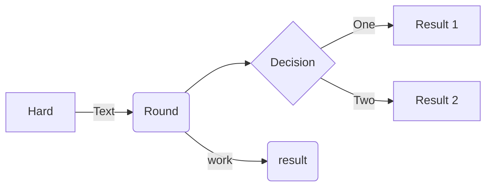
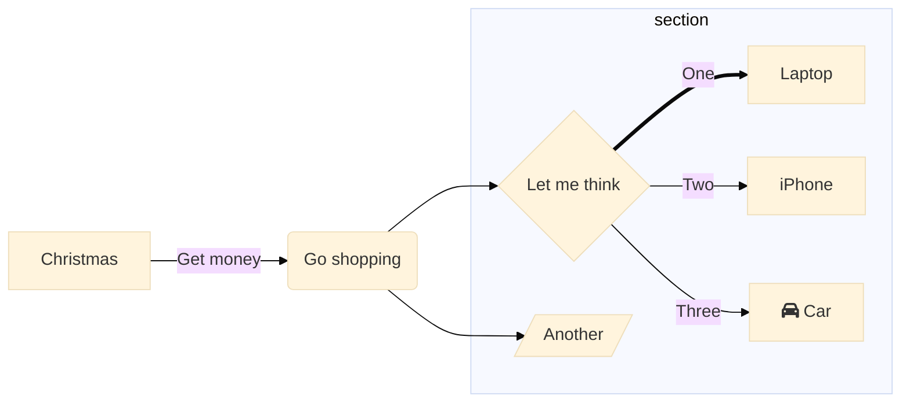
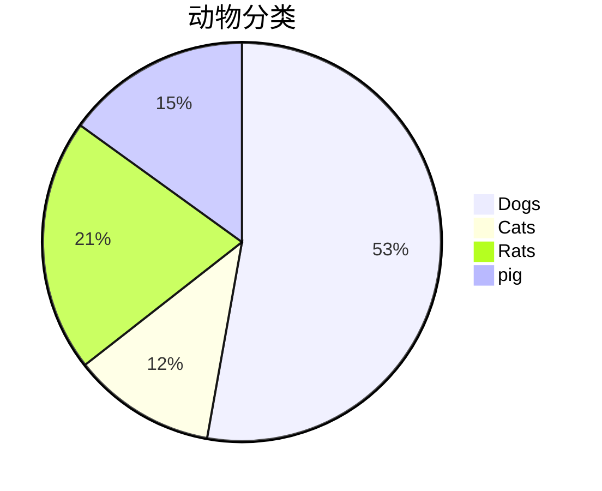
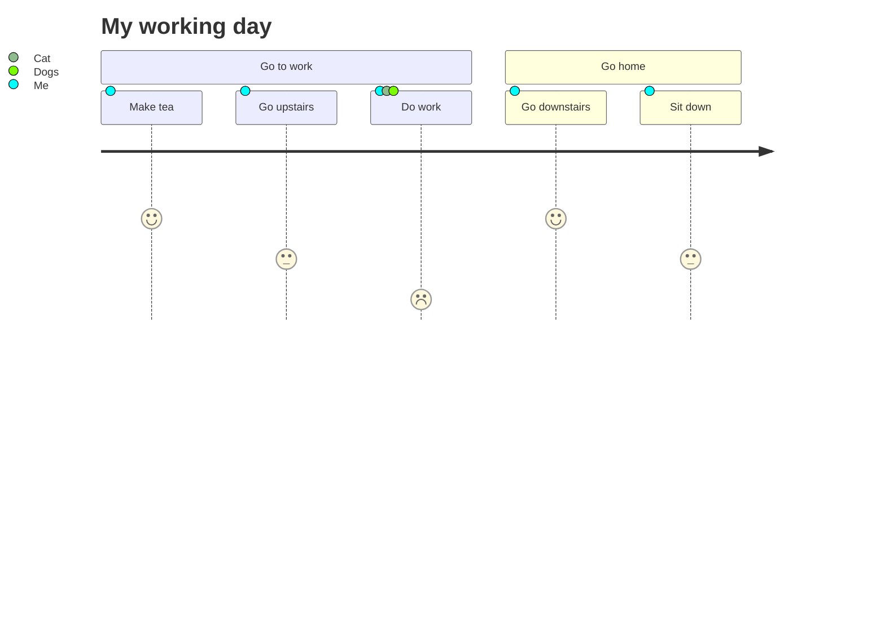
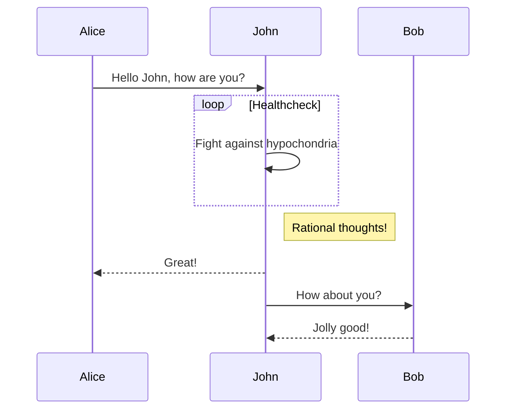
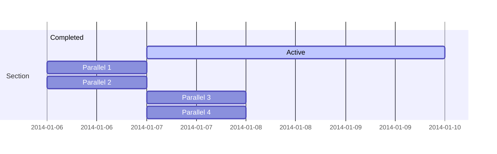
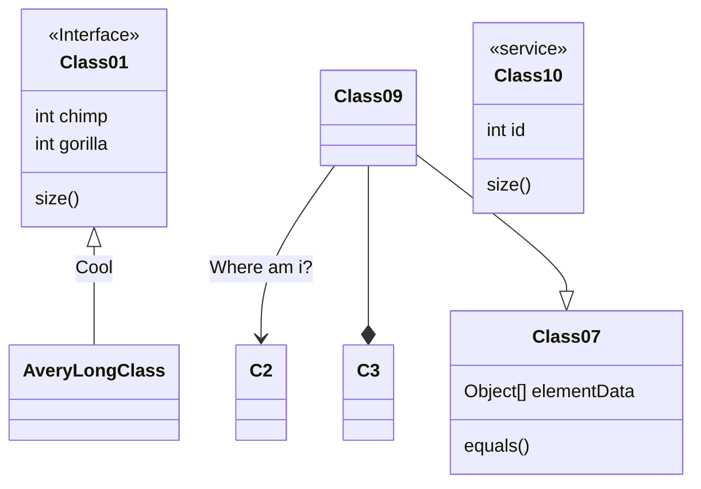

# extension-mermaid

流程图
[流程图语法](https://mermaid-js.github.io/mermaid/#/flowchart)

主题：base forest dark default neutral
%%{init: {'theme':'base'}}%% 

饼图

User Journey Diagram
[Link](https://mermaid-js.github.io/mermaid/#/user-journey)

时序图

甘特图

类图

