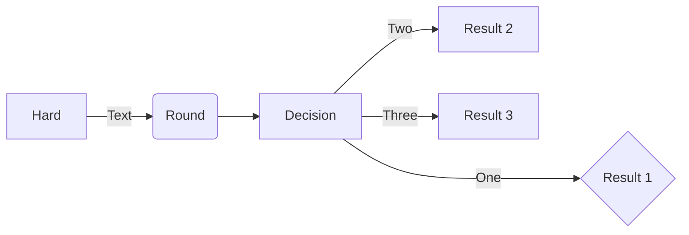

# new

[Link]()


::: type

::: tip Title
Content
:::


python 列表是什么

```html
<!-- --applet-- DEMO -->
<button onclick="ctx.ui.useToast().show(`info`, `HELLOWORLD!`)">TEST</button>
<a herf="www.baidu.com">link</a>
```
+ 中心节点{.mindmap}
    + aa
    + bb
        + cc --> 哈哈


```python
# --run--

import math

import requests
res = requests.get("http://www.baidu.com")
print(res)
list1 = list(range(10))

```

```shell
# --run--
echo 111


```
First header | Second header
:-----------:|:--------------:
AAAAAAAAAAAA | BBBBBBBBBBBBBB
AAAAAAAAAAAA | BBBBBBBBBBBBBB
AAAAAAAAAAAA | BBBBBBBBBBBBBB
AAAAAAAAAAAA | BBBBBBBBBBBBBB
AAAAAAAAAAAA | BBBBBBBBBBBBBB
Test | Test

```